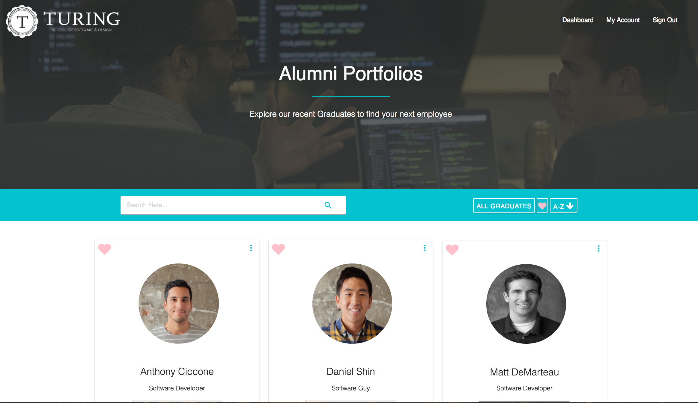
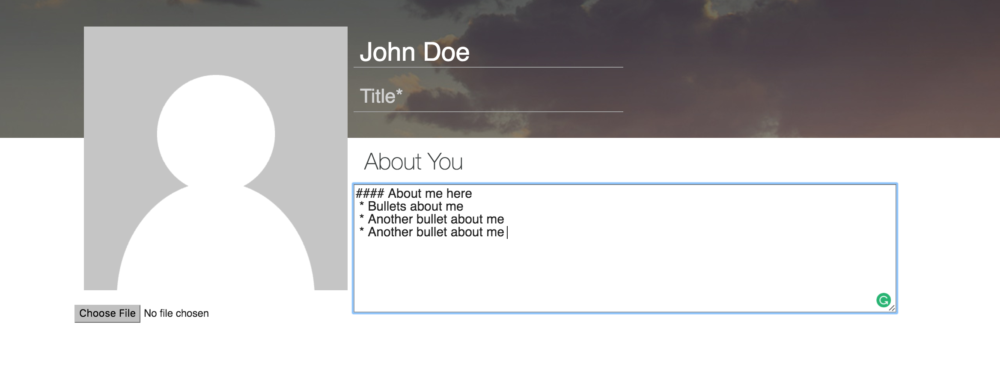
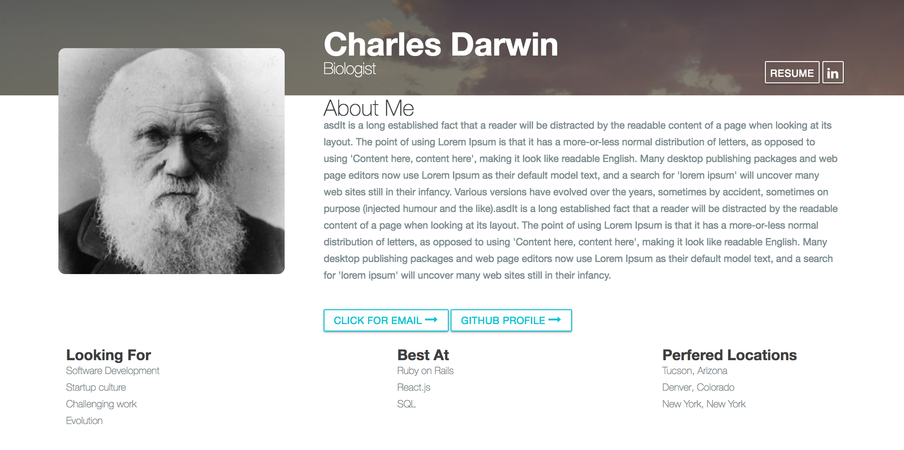

# Briefcase

Briefcase is an index of Turing alumni for employers to see. Students can create portfolios which detail the students' background and preferences. They are also able to link projects they worked on throughout their time at Turing.

Users login through Census, a third party application. All pictures and files are hosted on AWS S3.

<center></center>

## Getting Started

1. Clone the repository:
```shell
git clone git@github.com:turingschool-projects/briefcase.git
```
2. Bundle application
```shell
  bundle install
```
3. Install Figaro
```shell
  bundle exec figaro install
```
4. Configure the following keys in the application.yml file
 * census_id
 * cencus_secret
 * AWS_ACCESS_KEY_ID
 * AWS_SECRET_ACCESS_KEY  
 * S3_BUCKET_NAME
 * AWS_REGION

5. Install React.js
```shell
rails g react:install
```

## Running the tests

The test suite is running on Poltergeist and RSpec in order test the rails backend with the client side JavaScript. Poltergeist is a driver for Capybara.

To run all tests, run in the terminal:
```shell
rspec
```

## Functionality

#### Authorization
A user logs in with [Census](https://github.com/turingschool-projects/census) which will give them the ability to create a portfolio. Census provides basic user information including first name, last name, and email. Users can not sign in with out a Census login.

#### Alumni
A registered user or guest can view all Turing alumni who have created a portfolio on the root page. Each portfolio has the alumni's picture, name, title and bio. A user can narrow their results by searching for a user's information. They can favorite portfolios by clicking on the portfolio heart. Portfolios can be sorted alphabetically by clicking on the sort icon.  

#### Portfolios
Registered users can create a portfolio by visiting the dashboard page and clicking Create Portfolio. The portfolio requires the following fields
* Full Name
* Title
* Bio
* Email
* Github URL
* LinkedIn URL

Users can type markdown in the bio, looking for and best at fields. The fields accept fenced code blocks or any markdown format.
<center></center>

The markdown will be rendered on the alumni show page. The rendered markdown displays on the dashboard, alumni show page and the alumni index for each portfolio. After a user creates a portfolio, their portfolio will be visible on the alumni index page, where a user can view their individual profile.

<center></center>

Users can view, edit and delete their portfolio by visiting the dashboard.

#### Projects
Registered users can create up to three projects for their portfolio. Projects require the following fields:
* Name
* Github URL
* Description

Users can upload a picture per project. After the user creates a project, the projects will be visible in the user's portfolio public show page.

<center></center>

Users can also view, edit and delete their projects by visiting the dashboard.

## Deployment

Briefcase is currently deployed to two environments. Each environment is linked to different Census applications.
* Staging: https://turing-briefcase-staging.herokuapp.com
* Production: https://turing-briefcase-production.herokuapp.com

The development and master code branches are linked to Travis CI for continuous integration.

## Technology

The application is currently using the following technlogies:
* Server: Ruby On Rails 5.0.1
* Client-side: React
* Database: PostgreSQL
* Libraries: JQuery, RedCarpet, Axios, Paperclip
* Hosting: AWS S3

Data flows from the controllers to Rail's built in ERB views. The views then render React components and pass props. The components then handle the rendering of data, and any requests are sent back to the server via Axios.


## Authors
* [Daniel Shin](https://github.com/dshinzie/)
* [Anthony Ciccone](https://github.com/anticcone/)
* [Matt DeMarteau](https://github.com/MDes41)
